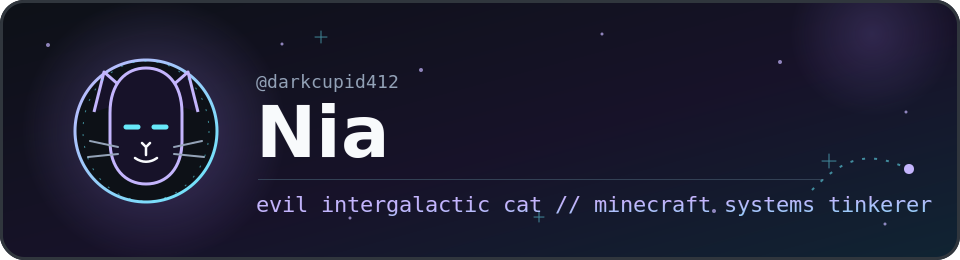
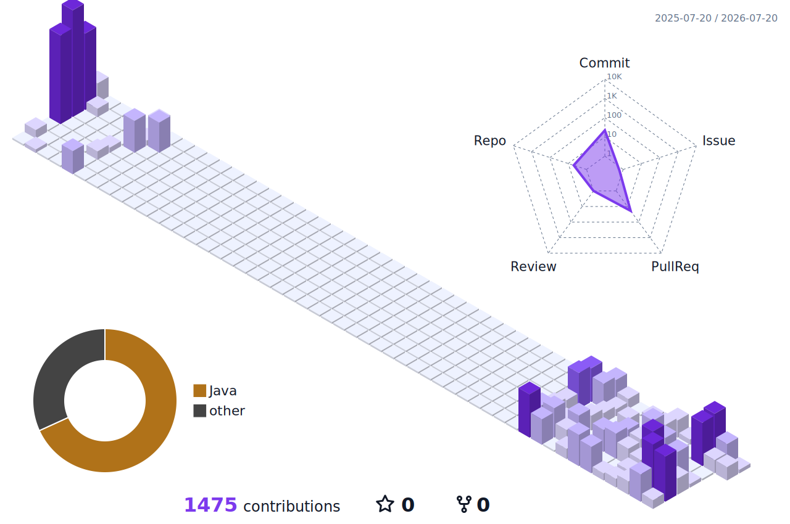

  <picture>
    <source media="(prefers-color-scheme: dark)" srcset="./assets/header-dark.svg">
    <source media="(prefers-color-scheme: light)" srcset="./assets/header-light.svg">
    
  </picture>

  <picture>
    <source media="(prefers-color-scheme: dark)" srcset="https://readme-typing-svg.demolab.com?font=JetBrains+Mono&amp;weight=500&amp;size=19&amp;pause=1200&amp;color=C4B5FD&amp;center=true&amp;vCenter=true&amp;repeat=true&amp;width=720&amp;height=42&amp;lines=bridging+editions+%E2%80%A2+bending+protocols+%E2%80%A2+fixing+collisions">
    <source media="(prefers-color-scheme: light)" srcset="https://readme-typing-svg.demolab.com?font=JetBrains+Mono&amp;weight=500&amp;size=19&amp;pause=1200&amp;color=7C3AED&amp;center=true&amp;vCenter=true&amp;repeat=true&amp;width=720&amp;height=42&amp;lines=bridging+editions+%E2%80%A2+bending+protocols+%E2%80%A2+fixing+collisions">
    
  </picture>

  I am an evil intergalactic cat. 
  Usually found somewhere between Minecraft Java, Bedrock cross-play, protocol libraries, and one suspicious collision box.

<h3 align="center">Current orbit</h3>

  <picture>
    <source media="(prefers-color-scheme: dark)" srcset="https://skillicons.dev/icons?i=java%2Cgradle%2Cgit%2Cgithub%2Cidea%2Cvscode&amp;theme=dark">
    <source media="(prefers-color-scheme: light)" srcset="https://skillicons.dev/icons?i=java%2Cgradle%2Cgit%2Cgithub%2Cidea%2Cvscode&amp;theme=light">
    
  </picture>

<h3 align="center">Recent work</h3>

<table>
  <tr>
    <td width="50%" valign="top">
      <h3><a href="https://github.com/darkcupid412/BetterHurricane">BetterHurricane</a></h3>
      
Bamboo and pointed-dripstone collision fixes for Bedrock players connecting through Geyser.

      working fork · Java · Bedrock compatibility
    </td>
    <td width="50%" valign="top">
      <h3><a href="https://github.com/darkcupid412/Geyser">Geyser</a></h3>
      
A bridge that lets Minecraft: Bedrock Edition clients connect to Java Edition servers.

      working fork · Java · protocol and cross-play
    </td>
  </tr>
</table>

<h3 align="center">Contribution skyline</h3>

  

 

  the snake stays — just as the quiet sign-off

  <picture>
    <source media="(prefers-color-scheme: dark)" srcset="https://raw.githubusercontent.com/darkcupid412/darkcupid412/output/github-snake-dark.svg">
    <source media="(prefers-color-scheme: light)" srcset="https://raw.githubusercontent.com/darkcupid412/darkcupid412/output/github-snake.svg">
    
  </picture>

